# AlphaNet

复现和优化华泰金工在2020年提出的端到端因子挖掘神经网络模型 [`AlphaNet`](https://crm.htsc.com.cn/doc/2020/10750101/74856806-a2e3-41cb-be4c-695dc6cc1341.pdf)，并搭建训练和预测框架，探索模型在多种金融场景下的应用。


## 课题背景

华泰金工于2020年6月设计了一种全新的网络结构：AlphaNet，能够端到端地解决多因子选股中的因子生成和多因子合成步骤，从而有效避免了传统方法中多步骤学习的人工干预和信息损失（例如：人工构造因子表达式、对多因子进行线性加权合成等）。

在传统的机器学习方法中，因子挖掘和多因子合成依然是两个完全分离的步骤，人工干预较多，容易存在不可避免的信息损失。AlphaNet模型（黑色虚线框）则借助深度学习端到端的特性，有效避免这一情况。

<center>
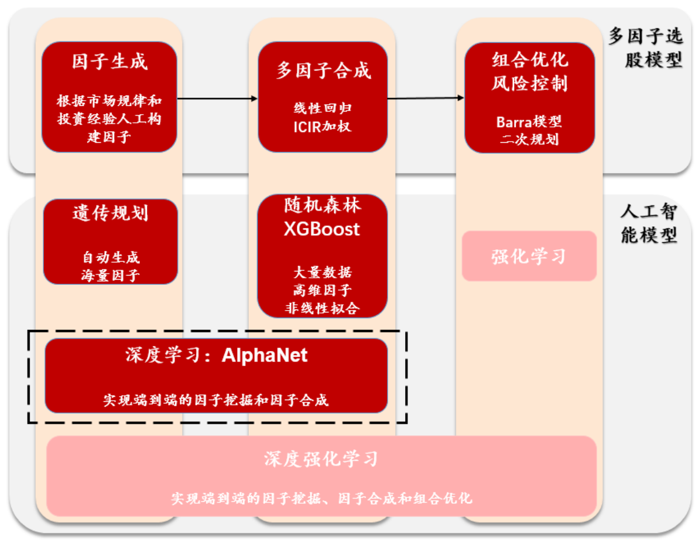
</center>

## 主要产出

- [模型复现](#模型复现)：
    - 实现自定义特征提取层
    - 复现完整的AlphaNet模型
      
- [框架搭建](#框架搭建)：
    - 数据处理框架
    - 模型训练框架
    - 模型预测框架
    - 模型检验框架

- [应用探索](#应用探索)：
    - 选股因子挖掘
    - 超额收益识别
    
- [模型优化](#模型优化)：
    - 新增均值因子特征
    - 引入自注意力机制


<a id="1"></a>
## 模型复现

（这里的模型指的是 [`AlphaNet-v2`](https://bigquant.com/wiki/doc/rengongzhineng-xilie-AlphaNet-jiegou-tezheng-zhengquan-20200824-gZhImiZjLC)，即华泰金工在提出最初的AlphaNet模型后2个月发布的改进版）

模型的结构：

1. **数据输入**：由个股日频量价数据构成的 “数据图片”
2. **特征提取层**：通过类似卷积的思想，对二维图表数据进行特征提取
3. **LSTM层**：通过LSTM模型，学习特征中的时序信息
4. **输出层**：将特征进行加权和，输出为预测值

<center>
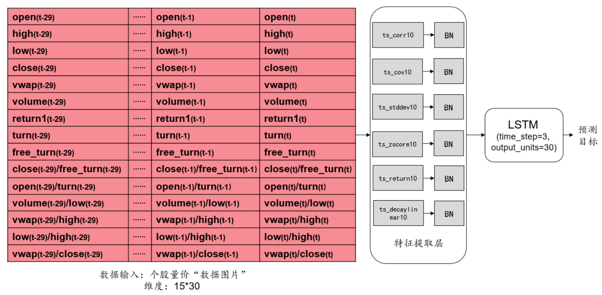
</center>

***

### 数据输入

股票数据虽然是时间序列数据，直观上用**RNN**（循环神经网络）等传统时序模型对其进行建模会比较有效。但是RNN的递归运算方式过于单一，很难有效地提取到股票数据中较为复杂的特征。

所以，AlphaNet借鉴了计算机视觉领域中最具影响力的**CNN**（卷积神经网络）网络的工作原理，将个股日频量价数据转换为 **`“数据图片”`**，然后通过一种类似卷积的计算方式来提取特征。

<center>
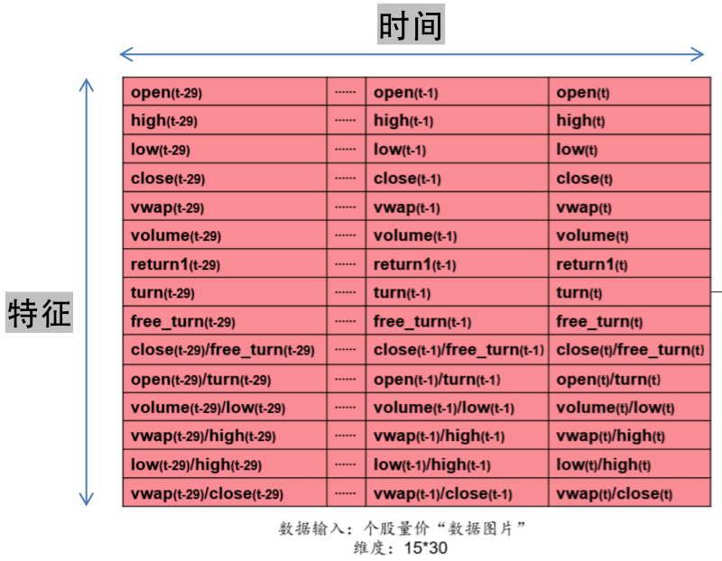
</center>

“数据图片” 的纵向是特征维度，横向是时间维度。如上图的第一行则是：某只个股，在为期30天的历史回看窗口区间内，每天的开盘价数值。

***

### 特征提取层

CNN中传统的卷积计算有2个问题：

1. 是基于局部感知的，和输入数据的排布方式有很大关系，然而股票数据和图片不一样，没有固定的排布方式，因此不同的排布方式很有可能会影响模型的效果
2. 本质上只是计算固定特征数据的加权组合，极大程度上限制了因子表达式的可能性

因此，AlphaNet引入了自定义的特征提取层，通过多种**运算符函数**，并通过**完整遍历**的方式，更加丰富且全面地提取 “数据图片” 中的信息。

<center>
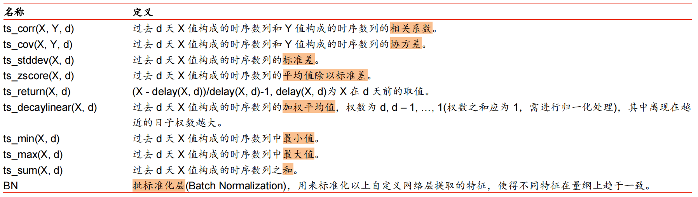
</center>

自定义的特征提取函数可以分为两大类：双变量函数和单变量函数。

例如 **`ts_corr(X, Y, 3)`** 就是双变量函数，对 “数据图片” 中的所有特征进行两两遍历匹配，计算两个窗口之间的相关度：

<center>
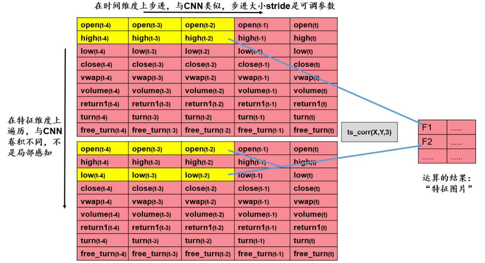
</center>

代码实现：

```python
class ts_corr(nn.Module):
    """
    计算过去 d 天 X 值构成的时序数列和 Y 值构成的时序数列的相关系数
    """

    def __init__(self, d=10, stride=10):
        """
        d: 计算窗口的天数
        stride：计算窗口在时间维度上的进步大小
        """
        super(ts_corr, self).__init__()
        self.d = d
        self.stride = stride

    def forward(self, X):

        # n-特征数量，T-时间窗口
        batch_size, n, T = X.shape

        # 初始化输出特征图
        w = int((T - self.d) / self.stride + 1)
        h = int(n * (n - 1) / 2)
        Z = torch.zeros(batch_size, h, w)

        # 遍历每个batch
        for batch in range(batch_size):
            # 主窗口：i 确定时间维度位置，j 确定特征维度位置
            for i in range(w):
                z = []
                start = i * self.stride
                end = start + self.d
                for j in range(n - 1):
                    # 主窗口
                    x = X[batch, j, start:end]
                    # 剩余窗口
                    y = X[batch, j + 1:, start:end]
                    # 计算两个窗口之间的相关系数
                    broadcasted_x = x.expand(len(y), -1)
                    r = pearsonr(broadcasted_x, y)
                    z.append(r)

                # 更新特征图
                Z[batch, :, i] = torch.cat(z, dim=0).T

        return Z
```

而 **`ts_stddev(X, 3)`** 就是单变量函数，会遍历 “数据图片” 中的所有特征窗口，计算窗口内数据的方差：

<center>
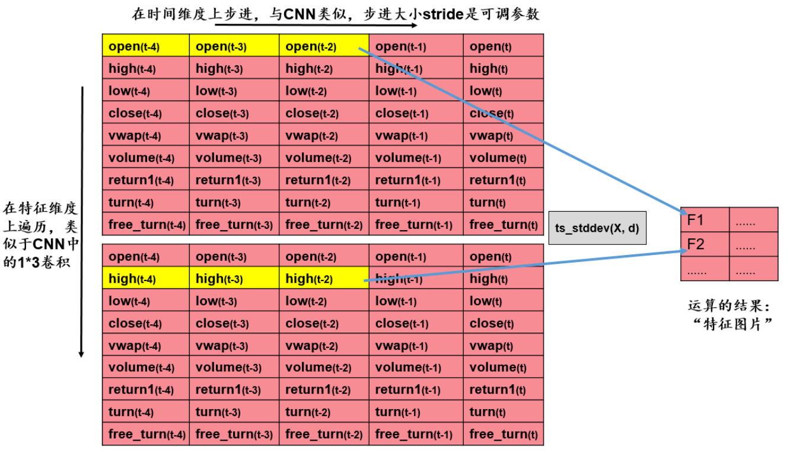
</center>

代码实现：

```python
class ts_stddev(nn.Module):
    """
    过去 d 天 X 值构成的时序数列的标准差
    """

    def __init__(self, d=10, stride=10):
        """
        d: 计算窗口的天数
        stride：计算窗口在时间维度上的进步大小
        """
        super(ts_stddev, self).__init__()
        self.d = d
        self.stride = stride

    def forward(self, X):

        # n-特征数量，T-时间窗口  
        batch_size, n, T = X.shape

        # 初始化输出特征图
        w = int((T - self.d) / self.stride + 1)
        Z = torch.zeros(batch_size, n, w)

        # 遍历每个batch
        for batch in range(batch_size):
            # 窗口：i 确定时间维度位置
            for i in range(w):
                start = i * self.stride
                end = start + self.d
                x = X[batch, :, start:end]
                # 计算窗口的方差
                std = torch.std(x, dim=1)
                # 更新特征图
                Z[batch, :, i] = std
              
        return Z
```

剩下的自定义特征提取层的计算逻辑和上面两种框架基本一致，只是需要根据函数的定义改变一下实际计算的值。

***

### LSTM层

经过特征提取层得到的特征仍然具有时序信息，所以我们需要用像 **LSTM** 这样的网络结构来捕捉特种中的时序信息。

<center>
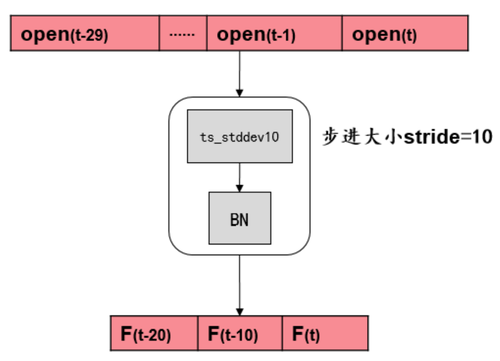
</center>

LSTM网络利用记忆门控机制，有效筛选每个时间步内的重要信息传递到下一个时间步，并通过这样反复地单调递归运算，把整个时间序列数据的有效信息给提取出来。

***

### 输出层

输出层是简单的全连接层，通过对输入特征做加权和的方式，输出一个预测值。

（**完整的特征提取层和模型的代码实现，请参考 models.py 文件**）


<a id="2"></a>
## 框架搭建

为了能够训练模型，使用模型做预测，检验模型效果，将模型应用于不同的场景，我们需要三个基础的框架：
- 数据处理框架
- 模型训练框架
- 模型预测框架

***

### 数据处理框架

我们从Wind上获取了整个A股股池从2011.01.31到2023.05.31期间所有股票的日频量价数据，并对数据做了如下处理：

<center>
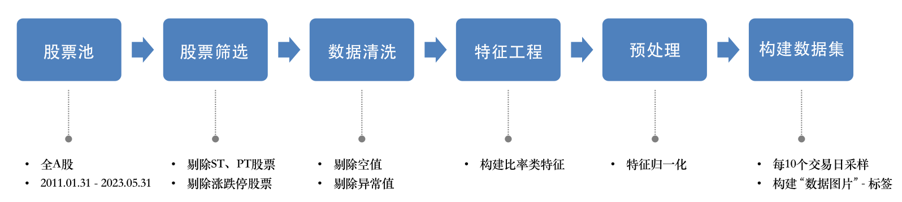
</center>

需要明确一点是，Wind上获得的原始数据是每一个交易日为一个单独的csv文件，所以在进行数据处理之前，我们是做了一个表合并的动作的，合并后我们获得了一个单独的数据表（下图为前5行）：

<center>
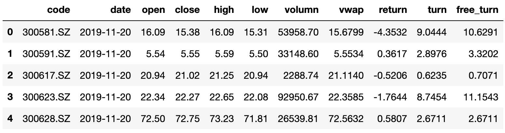
</center>

在进行数据处理之前：共计10127535条数据，5324支股票，2996个交易日。为了防止非正常股票影响模型训练效果，我们剔除了ST（特殊处理股票）股票、PT（特别转让股）股票、预测目标日期下一交易日涨跌停的股票，最后剩余1098484条数据，1194支股票。

接下来，我们通过原始特征，构建了6个比率类特征，以此来获得更丰富的信息：

<center>
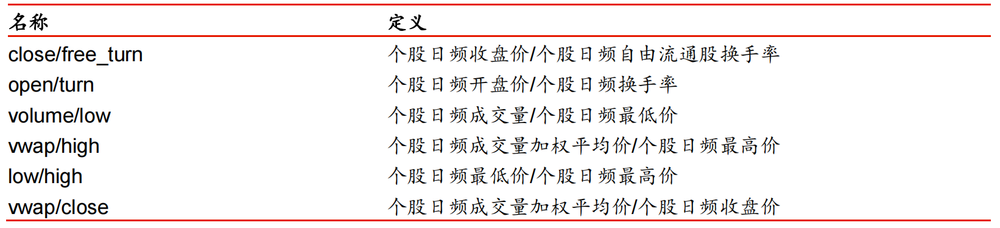
</center>

然后，为了防止模型被不同特征数值规模之间较大的差异影响，我们对每一个特征都分别做了归一化处理：

```python
# 对每个特征分别进行归一化（除了股票代码、日期和标签）
for feature in df.columns[2:-1]:
    df[feature] = (df[feature] - df[feature].mean()) / df[feature].std()
```

最后，我们通过每隔10个交易日采一次样的方式，构建 “数据图片” 和对应的标签：

```python
X, Y, Y_dates, empty = [], [], [], []

for code in tqdm(df_merged['code'].unique()):
    
    x, y, dates = [], [], []
    
    # 每个个股单独采样
    df = df_merged[df_merged['code']==code]
    
    i = 0
    while i + 40 < len(df):
        
        # 标签对应的日期
        date = df.iloc[i+40]['date']
        dates.append(date)
        
        # 特征：30天的历史窗口，构建 “数据图片”
        window = df.iloc[i:i+30, 1:-1]
        window.set_index('date', inplace=True)
        window = window.transpose()
        x.append(np.array(window))
        
        # 标签：第i+40天的收益率
        y.append(df.iloc[i+40]['target'])
        
        # 每间隔10个交易日采样一次
        i += 10
    
    # 如果该个股的数据不够，跳过
    if not x or not y:
        empty.append(code)
        continue
    
    # 将该个股的所有的 样本-标签 组合加入到数据集中
    x = np.stack(x)
    y = np.stack(y)
    y_dates = np.stack(dates)
    X.append(x)
    Y.append(y)
    Y_dates.append(y_dates)

# 根据标签日期对数据集进行排序
Y_dates = np.concatenate(Y_dates, axis=0)
order = np.argsort(Y_dates)
X = np.concatenate(X, axis=0)[order]
Y = np.concatenate(Y, axis=0)[order]
Y_dates = Y_dates[order]
```

（**具体代码实现，请看 数据准备(FE).ipynb 和 构建数据集.ipynb 文件**）

***

### 模型训练框架

首先，我们选择用CPU来训练模型，因为特征提取层的计算无法完全矩阵化，所以使用CPU训练会比GPU更快：

```python
device = torch.device("cpu")
```

我们采用滚动训练法，让模型在时间轴上每隔半年滚动训练一次。每次在1500个交易日的样本内数据上进行训练和验证，训练集和验证集的比例为4:1。验证集的主要目的是用来判断模型最佳的迭代次数（是否需要早停）。样本外的测试集为紧跟着样本内数据的后126个交易日（半年）。下一次训练时，则将整个样本内/外数据窗口在时间轴上向右移动126个交易日，如图：

<center>
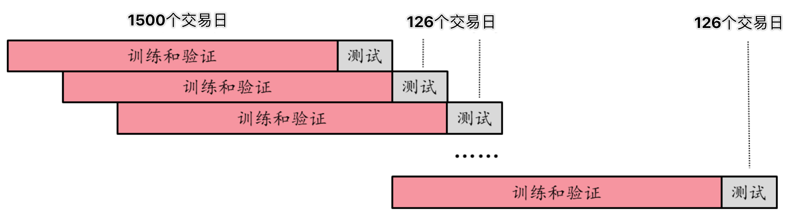
</center>

为什么用滚动训练？
- 模拟真实情况：对于股价预测等需要及时响应的任务，滚动训练相当于模拟实际场景中模型不断根据最新数据更新自身参数的行为，让模型学会适应新的数据并提供稳定的预测结果
- 稳定/鲁棒性：在时序数据中，可能存在噪声、季节性变化、周期性变化等影响因素，滚动训练可以使模型在不同时间点上观察到这些变化，并逐渐适应和学习这些模式
- 泛化能力：滚动训练可以让模型在每个时间步上都进行训练和预测，使其能够适应不同时间点上的数据分布和特征，减少模型对特定时间点上数据分布的依赖

以预测个股收益率任务为例，训练模型，并观察模型在训练集和验证集上的表现：

<center>
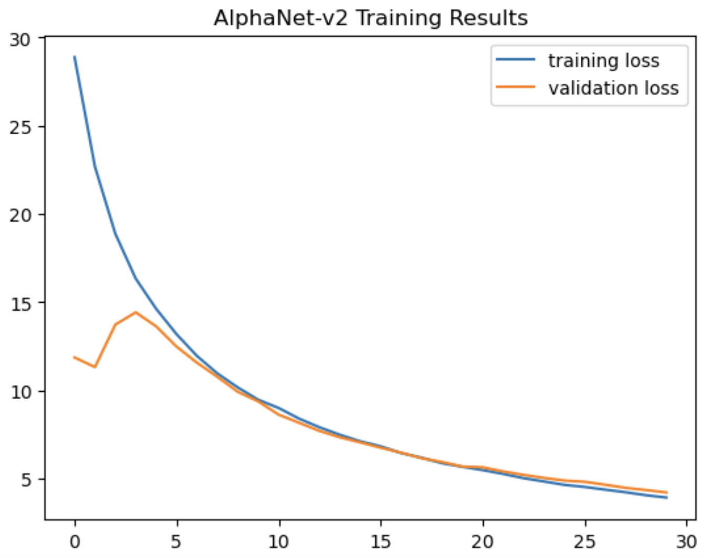
</center>

可以从图中看出，模型的收敛效果还是比较可观的。同时，模型在训练和验证集上的损失逐渐贴合，并没有出现过拟合的现象。

（**具体代码实现，请看 训练框架.ipynb 文件**）

***

### 模型预测框架

初始化模型，从本地导入训练好的模型参数：

```python
model_path = 'Models/alphanet_v2_0.pt'
net = AlphaNet_v2(d=10, stride=10, n=15)
load_model(net, model_path)
```

使用模型对新数据做预测：
```python
net.eval()
y_preds = net(X).squeeze().detach().numpy()
```

同样以预测个股收益率为例，展示最后一轮的训练集前150个样本的预测结果：

<center>
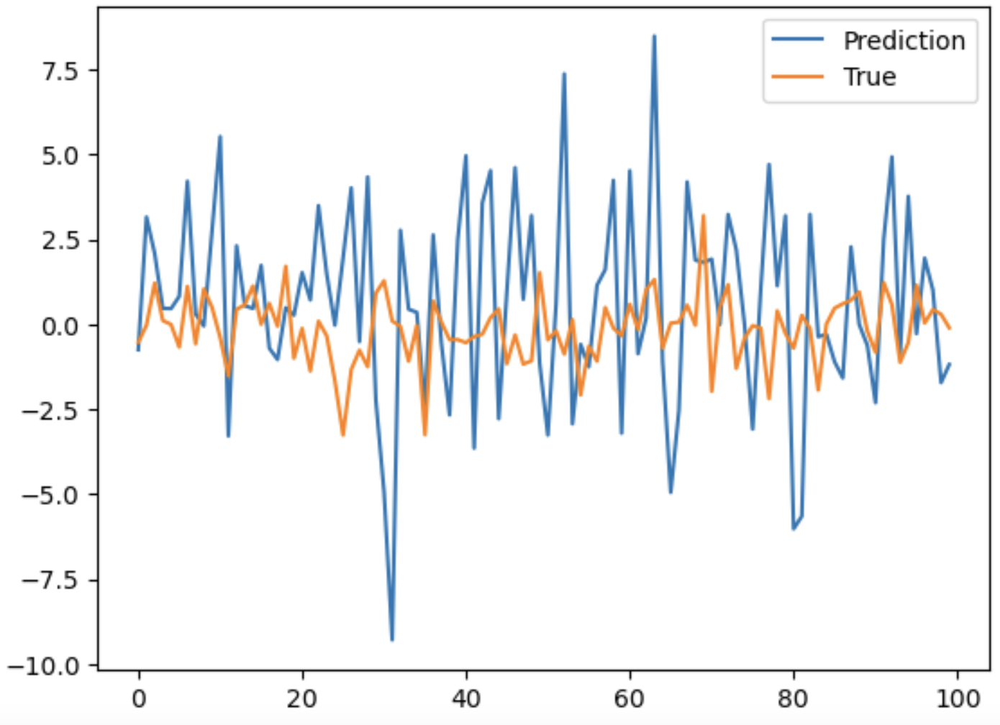
</center>

（**具体代码实现，请看 预测框架.ipynb 文件**）

***

### 模型回测框架

在因子构建任务中，除了观察模型预测值与真实值之间的相似度，我们还需要对模型挖掘出来的因子进行回测，以验证因子的有效性。

对于选股因子来说，最常见的回测方式就是单因子IC回测，通过计算 **RankIC (Rank Information Coefficient)** 来衡量选股因子与股票收益排名之间的相关性的指标，从而评估选股因子的有效性和稳定性。

计算RankIC的步骤如下：

1. 对于每个时间点，根据选股因子的值对股票进行排名，得到每个股票在因子上的排名值
2. 对于每个时间点，根据股票的实际收益对股票进行排名，得到每个股票在收益上的排名值
3. 计算因子排名和收益排名之间的相关性，可以使用秩相关系数或皮尔逊相关系数，即为当下时间点的RankIC
4. 对所有时间点的RankIC进行统计分析，例如：计算平均值、标准差、假设检验等

代码实现：

```python
import scipy.stats as stats

def compute_RankIC(X, Y, model, target_dates):

    results = []
    unique_dates = np.unique(target_dates)
    
    # 针对每个目标日期，对比当天真的股票收益率排名和预测的排名
    for date in tqdm(unique_dates):
        
        # 获取当日所有股票的信息
        idx = np.where(target_dates==date)[0]
        
        # 当日小于20支股票，跳过该日
        if len(idx) < 20:
            continue
        
        # 预测个股收益率值
        model.eval()
        y_preds = -model(torch.tensor(X[idx]).float()).squeeze().detach().numpy()
        
        # 计算排名
        y_rank = np.argsort(Y[idx]).argsort() + 1
        y_pred_rank = np.argsort(y_preds).argsort() + 1
        
        # 计算排名之间的相关度
        correlation, _ = stats.spearmanr(y_rank, y_pred_rank)
        results.append(correlation)
        
    return np.array(results)
```

以模型预测出来的个股收益率作为选股因子为例，模型在最后一个训练轮次中，测试集单因子IC回测的效果如下：

<center>
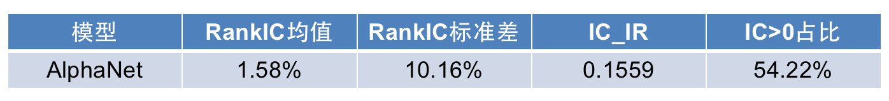
</center>

（**具体代码实现，请看 回测框架.ipynb 文件**）


## 应用探索

我们探索了AlphaNet模型的2个应用场景：选股因子挖掘 & 超额收益股识别。

选股因子挖掘：
- 预测个股收益率的具体数值，作为选股因子
- 根据因子对个股进行排序，从而构建投资组合

超额收益股识别：
- 预测个股超额收益的方向
- 从而识别出能够打败市场、具有超额收益的个股

***

### 选股因子挖掘

底层任务是使用模型预测个股在某个日期的收益率数值，以此作为该股的因子，并根据因子的数值对当日所有股票进行排序，选择排名靠前的股票构建投资组合，所以模型本质上是在做回归预测。

模型的预测结果（最后一个测试集的前150个样本）：

<center>

</center>

模型的因子挖掘质量（单因子IC回测）：

<center>

</center>

从图表中可以看出，模型挖掘出来的选股因子的排序（选股）能力并不佳，原因可能是：
- 用的MSE而不是IC作为loss来优化模型
- 收益率的数值本身就很难预测

***


### 超额收益股识别

虽然模型的单因子IC回测效果一般，但从预测结果的展示图可以观察到，模型在很多处都出现了预测值非常贴合真实值的情况，特别是当收益率非常高的时候：

<center>
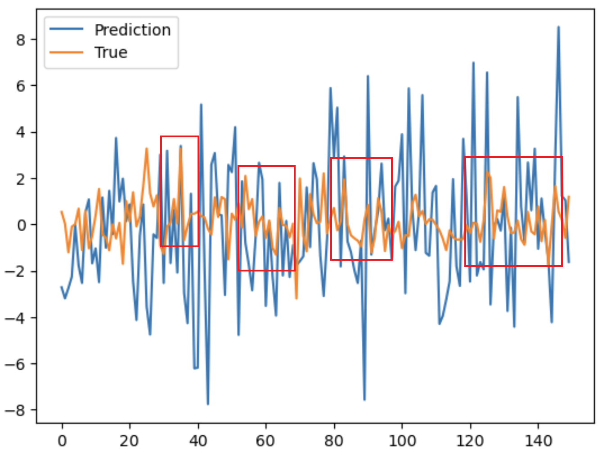
</center>

因此，我们决定探索模型是否有能力找出一些在固定日期会获得超额收益的股票，即：超额收益股识别。

首先，我们需要定义这个任务对应的标签：个股在某个日期是否为超额收益股（0:不是，1:是），是一个二分类任务。我们通过判断在某个日期某个股的收益率是否大于当日市场上所有股票的收益率均值，来确定该个股在该日期的标签。

```python
# 构建超额收益标签：判断个股在对应日期的收益率是否超过当天的市场均值，超过则标签为1，否则为0

memo = {}
Y_cls = []

for i in tqdm(range(len(Y))):
    
    # 目标日期
    date = Y_dates[i]
    
    # 获取当天的市场收益率均值
    if date in memo:
        avg = memo[date]
    else:
        avg = df_merged[df_merged['date']==date]['target'].mean()
        memo[date] = avg
    
    # 判断标签取值
    if Y[i] > avg:
        Y_cls.append(1)
    else:
        Y_cls.append(0)
```

为了评估模型效果，我们采用了4种针对分类任务设计的评估指标：

```python
# 计算准确率
def compute_accuracy(y_true, y_pred):
    assert (len(y_true) == len(y_pred))
    return accuracy_score(np.array(y_true), np.array(y_pred))

# 计算f1-score
def compute_f1(y_true, y_pred):
    assert (len(y_true) == len(y_pred))
    return f1_score(np.array(y_true), np.array(y_pred))

# 计算MCC
def compute_MCC(y_true, y_pred):
    assert (len(y_true) == len(y_pred))
    return matthews_corrcoef(np.array(y_true), np.array(y_pred))

# 计算4种指标
def evaluate_metrics(preds, labels):
    labels = [int(item) for item in labels]
    preds = [0 if item < 0.5 else 1 for item in preds]
    accuracy = compute_accuracy(labels, preds)
    f1 = compute_f1(labels, preds)
    mcc = compute_MCC(labels, preds)
    cm = confusion_matrix(labels, preds)
    return accuracy, f1, mcc, cm
```

我们对模型最后的数值输出进行了sigmoid函数处理（将数值压缩到0-1的区间，代表该个股在该日期为超额收益股的可能性），并采用了交叉熵作为训练的损失函数：

```python
# 初始化输出处理层（Sigmoid函数）、损失函数和优化器
f = nn.Sigmoid()
criterion = nn.BCELoss()
```

模型效果：

<center>
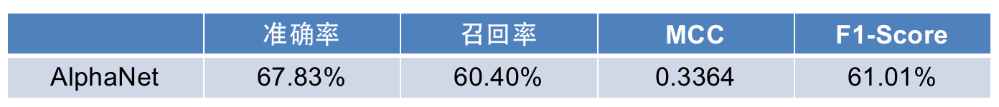
</center>

正如我们所期待的，模型在识别超额收益股任务上的表现会比在挖掘选股因子任务上的表现要优异，原因可能是：
- 二分类任务本身相较于回归任务就更加简单
- 我们观察到模型对高收益率样本比较敏感，至于背后的具体原因，可以考虑做高收益样本和低收益样本的特征可视化（经过特征提取层后），然后进行对比


## 模型优化

我们分别从2个角度，提出了2种优化方案：

- 特征角度：构建均值因子特征，丰富对市场整体环境变化的刻画
- 模型角度：引入自注意力机制，引导模型关注时序数据中重要的部分

***

### 构建均值因子特征

我们认为，股票收益的变化不仅仅和股票本身的特征（如开盘价、收盘价、最高价等）相关，还与市场的整体环境（如宏观状态、市场风格等），且市场环境也是存在时变特性的。因此，我们引入了能够刻画市场环境变化的新特征：均值因子，以反映原始因子整体分布的时变特性，即：市场整体环境的动态。

均值因子的构建过程：

1. 针对每个交易日，计算所有股票每个特征的均值，作为均值因子特征
2. 同一个交易日内，所有股票的均值因子是一样的
3. 不同交易日内，同一股票的均值因子是不一样的

同时，为了让模型知道均值因子只是起辅助作用，重点还是应该放在个股本身信息的挖掘上，我们对均值因子乘以一个弱化项0.01，代码实现如下：

```python
for feature in df.columns[2:11]:
    mean_feature = feature + '_mean'
    df_[mean_feature] = 0.01 * df.groupby('date')[feature].transform('mean')
```

优化效果：

<center>
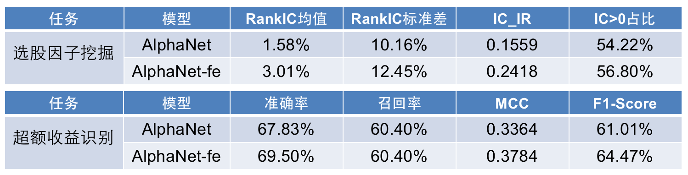
</center>

由上图可看出，新增的均值因子特征在挖掘选股因子和识别超额收益股两个任务上都给模型带来了性能的提升。

***

### 引入自注意力机制

LSTM网络结构采用的是单调递归的运算方式，这会导致几个问题：

- 在处理长序列时容易面临梯度消失或梯度爆炸的问题
- 无法感知上下文，只能是单向累积获取的信息
- 无法并行运算，每个时间步的计算都依赖于前一个时间步的输出

用自注意力（Self-Attnetion）机制替换掉LSTM层能够很好地避免这些问题。最重要的是，自注意力机制具有较强的可解释性，通过可视化注意力权重，可以得知模型在预测的时候关注的是输入的特征的哪些部分，使得决策过程更加透明，也能帮助加深对不同因子的理解。

我们使用 多头自注意力+层归一化 代替了 LSTM+批量归一化：

```python
# 多头自注意力机制 + 层归一化
self.mha = nn.MultiheadAttention(embed_dim=n_in,
                                 num_heads=3,
                                 dropout=0.1,
                                 batch_first=True)
self.ln = nn.LayerNorm(n_in)
```

优化效果：

<center>
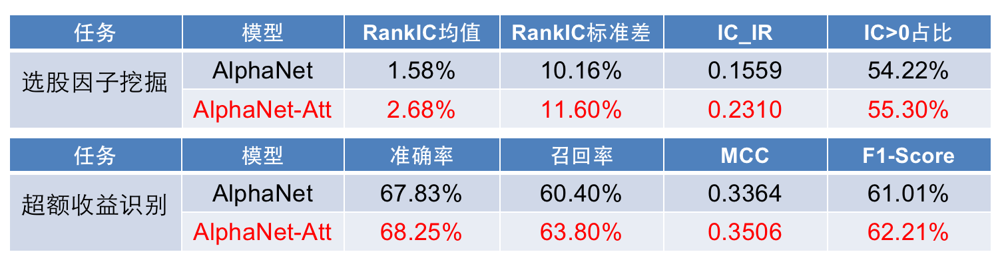
</center>

虽然引入自注意力机制给模型带来的提升比较微小，没有新增均值因子那么大，但是我们现在可以通过分析注意力权重来深入理解模型的决策过程了：

<center>

</center>

xxxxxxxx


## 项目总结和未来展望

本文从零开始复现了华泰金工提出的因子挖掘神经网络模型AlphaNet，在此基础上搭建了4个使用模型的框架（数据处理框架、模型训练框架、模型预测框架、模型回测框架），并通过框架将模型应用于2个不同的场景（选股因子挖掘、超额收益股识别），最后提出了2种不同角度的优化方案，并通过实验验证了它们的有效性。

未来可以继续发展的方向：

- 在单因子IC测试的基础上，加上因子的分层回测，进一步验证模型挖掘出来的因子是否能用来构建投资组合
- 模型的可视化分析，透明化模型的决策过程，例如特征提取的成果展示、自注意力层的权重等
- 探索模型在主动风控方面是否有应用场景，例如挖掘风控因子、识别牛熊市做预警等

